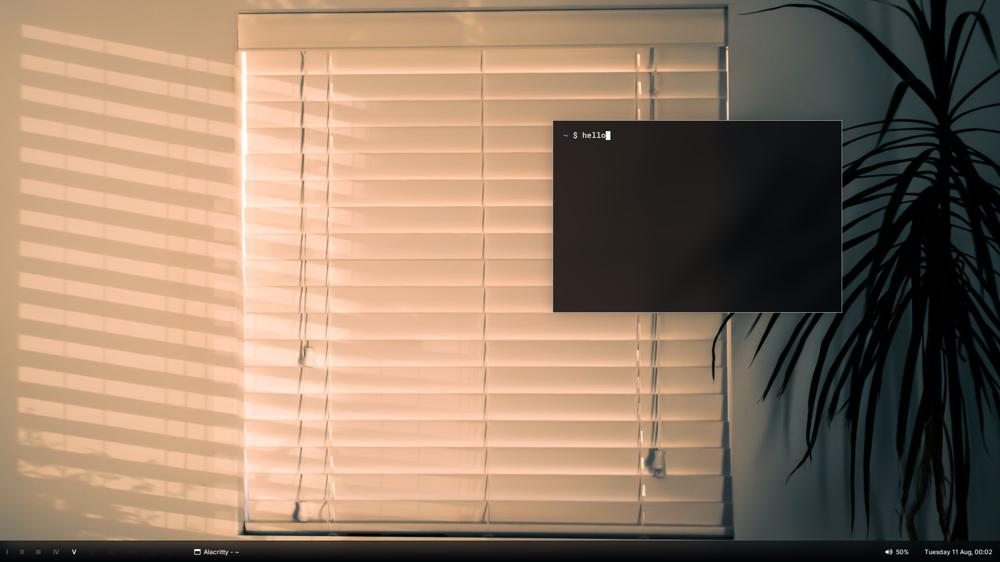
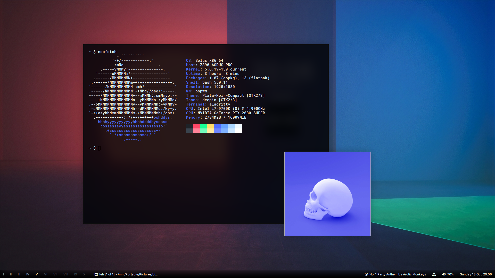
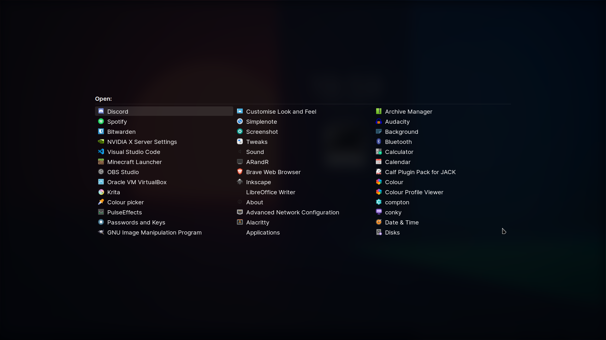
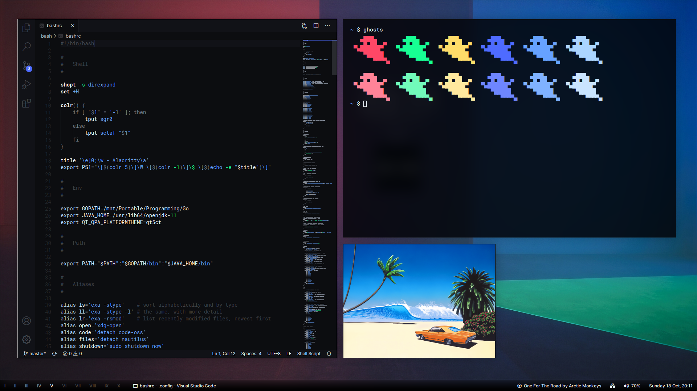

# dots

**OS**:            Solus  
**WM**:            bspwm  
**Bar**:           polybar  
**Launcher**:      rofi  
**Compositor**:    picom  
**Notifications**: dunst  
**Terminal**:      alacritty  
**GTK**:           plata-noir-compact  
**Icons**:         deepin  
**Cursor**:        deepin  

